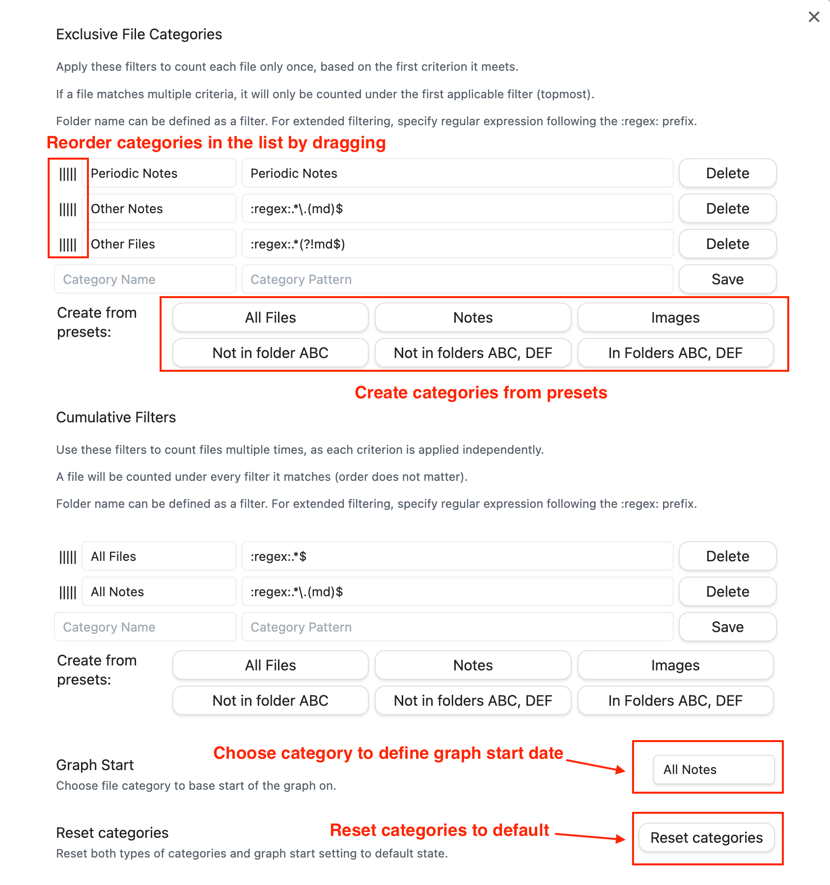

# Vault Size History for Obsidian

This [Obsidian](https://obsidian.md/) plugin enables users to visualize the historical growth of your vault by displaying a graph that tracks the number of files over time

[Guide for version 1.0.x](LegacyGuide.md)


## Usage

Use the Vault Size History button in Ribbon bar to display the graph.

Graph Legend allows to hide/show graphs for different categories of the files. The categories can be configured in the settings.

By clicking on a line name in the legend, you can hide/show the line.

## Settings

### Date format

It is possible to change the display format of the dates.

Examples of supported formats:

- mm/dd/yyyy - 01/28/2024
- m/d/yy - 1/28/24
- yyyy-mm-dd - 2024-01-28

### File categories



File categories section allows to define custom groups of files based on filters. Each category is rendered as a separate line on the graph.

Each category has `name` which is displayed in the legend of the graph.

`Category pattern` field is used to define filter to match files against.

Plugin takes full path to a file within Vault when checking the criterion.

Currently supported types of filters are:

- Plain text e.g. 'Examples'. The plugin will check if full path to a file starts with the specified text.
- Regular expression. To define the filter, preface the regular expression with `:regex:`. The plugin applies the expression to the full path to the file, which allows to specify criteria based on folder name, file name or file extension.

There are two types of categories.

#### Exclusive categories

The first matching filter from this list will be used to categorize a file. If a file matches multiple criteria, it will only be counted under the first applicable filter
(topmost). Use grabbing area on the left side of the list to reorder filters.

#### Inclusive categories

A file will be counted under every filter it matches. Order of items in this list does not affect numbers you will see in the graph.

#### Example

Let's say there is a number of files in different folders of the Vault. One of the root folders is called `Periodic Notes`.

The exclusive list of categories is defined as following:


- Periodic Notes - `Periodic Notes` (this will count all files in the Periodic Notes folder)
- Other Notes - `:regex:.*\.(md)$` (this will count all Notes not matching the first filter)
- Other Files - `:regex:.*$` (this will count all files in the Vault not matching first two filters)

If Other Files filter was the only filter in the list, it would display total number of files in the Vault. But being part of exclusive list in the last place, it will only show a subset of files that do not match other filters from this list.

So what if we want to the total number of files along with categories defined above? 

This is done using inclusive list. We can use the same filter when specifying a new category in this list:


- All Files - `:regex:.*$`

This configuration gives us the desired four lines on the graph:


In this example the numbers from the first three categories stack together to cover all files in the vault also represented by fourth category:

```
Periodic Notes + Other Notes + Other Files = 29 + 75 + 254 = 358

All Files = 358
```

## Feedback
If you encounter any issues or have feedback about the plugin, feel free to open an issue on the [GitHub repository](https://github.com/technerium/obsidian-vault-size-history).

## Acknowledgements

The plugin would not be possible without the community:

- [Obsidian](https://obsidian.md/) is the host application for the plugin.
- Plugin uses [Apache ECharts](https://echarts.apache.org) to render graphs.
