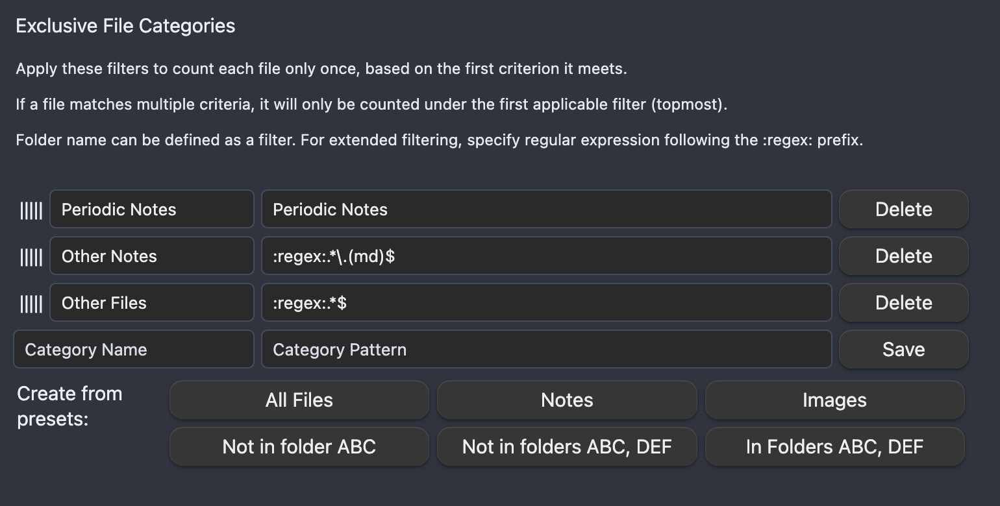

# Vault Size History for Obsidian

This [Obsidian](https://obsidian.md/) plugin enables users to visualize the historical growth of your vault by displaying a graph that tracks the number of files over time

[Guide for version 1.0.x](LegacyGuide.md)


# Usage

Use the Vault Size History button in Ribbon bar to display the graph.

Graph Legend allows to hide/show graphs for different categories of the files. The categories can be configured in the settings.

By clicking on a line name in the legend, you can hide/show the line.

# Settings

## Graph Settings


### Display Date format

It is possible to change the display format of the dates.

Examples of supported formats:

- mm/dd/yyyy - 01/28/2024
- m/d/yy - 1/28/24
- yyyy-mm-dd - 2024-01-28

### Legend Sorting Order

This setting controls the order in which line titles are displayed. It allows you to choose how the legend entries are organized based on the chart values.

The two options available are:

**Ascending Value**: In this option, the legend entries are sorted so that the lines with the lowest chart values appear first. This means that as you read the legend from left to right, the values represented by each line increase.

**Descending Value**: In this option, the legend entries are sorted so that the lines with the highest chart values appear first. This means that as you read the legend from left to right, the values represented by each line decrease.

### File categories

File categories section allows to define custom groups of files based on filters. Each category is rendered as a separate line on the graph.

Each category has `name` which is displayed in the legend of the graph.

`Category pattern` field is used to define filter to match files against.

Plugin takes full path to a file within Vault when checking the criterion.


Currently supported types of filters are:

- Plain text e.g. 'Examples'. The plugin will check if full path to a file starts with the specified text.
- List of folders. Define list using format `:in:[Folder Name 1:Folder Name 2:Folder Name 3]` and the plugin will count files in these folders.
- List of folders (negative match). Define list using format `:not_in:[Folder Name 1:Folder Name 2:Folder Name 3]` and the plugin will count files that are not in these folders.
- Regular expression. To define the filter, preface the regular expression with `:regex:`. The plugin applies the expression to the full path to the file, which allows to specify criteria based on folder name, file name or file extension.

There are two types of categories.

### Exclusive categories


The first matching filter from this list will be used to categorize a file. If a file matches multiple criteria, it will only be counted under the first applicable filter
(topmost). Use grabbing area on the left side of the list to reorder filters.

### Inclusive categories

A file will be counted under every filter it matches. Order of items in this list does not affect numbers you will see in the graph.

### Example

Let's say there is a number of files in different folders of the Vault. One of the root folders is called `Periodic Notes`.

The exclusive list of categories is defined as following:


- Periodic Notes - `Periodic Notes` (this will count all files in the Periodic Notes folder)
- Other Notes - `:regex:.*\.(md)$` (this will count all Notes not matching the first filter)
- Other Files - `:regex:.*$` (this will count all files in the Vault not matching first two filters)

If Other Files filter was the only filter in the list, it would display total number of files in the Vault. But being part of exclusive list in the last place, it will only show a subset of files that do not match other filters from this list.

So what if we want to show the total number of files along with categories defined above?

This is done using inclusive list. We can use the same filter when specifying a new category in this list:


- All Files - `:regex:.*$`

This configuration gives us the desired four lines on the graph:


In this example the numbers from the first three categories stack together to cover all files in the vault also represented by fourth category:

```
Periodic Notes + Other Notes + Other Files = 29 + 75 + 254 = 358

All Files = 358
```

### Graph start

The graph start setting allows to choose what data should define the left (start) date of the graph. Any or none of the categories can be used.

This is helpful, if the Vault includes very old non-MD files (like attachments), but you want to track the history from the first note.

Example: on 1/31/2021 the first note had been created, but Vault has 5 attachments from 2008 year. If no setting is specified, the graph will show the lines starting in 2008. If the setting is set to an MD file category, then the graph will start on 1/31/2021, but the graph of non-MD files will have initial value of 5 (all files that had been created before graph start date).


### Reset categories

Use this button to reset the list of categories to the default.

## File metadata

This group of settings allows to control how the plugin should identify file creation dates for the files in the Vault.

By default, the plugin uses file creation date defined by the system. As per issue #5, system information might not be reliable due to different reasons like file sync/copy when the file is considered recreated.

There are two advanced ways to define file creation dates:

1. Date property in the frontmatter. This applies to MD files only (Notes).
2. An index file. Plugin will maintain an index CSV file in the Vault, where for each of the file in the Vault it will keep the earliest identified file creation date. This method handles all types of the files in the Vault.

If both settings are configured, the Date property takes precedence over index file (for Notes i.e. MD files):

Frontmatter Property (for Notes) > Automated CSV Index file > System file metadata


### In-Note date property

The `Date property` setting accepts a frontmatter property name to be used to parse the date from.

### Date property format

`Date property` field's value is parsed to a valid Date using the format defined in the `Date property format`.

It is empty by default and the parsing will not work until the format is defined.

The plugin uses the `Moment.JS` library which is available in Obsidian to work with the dates. Please refer to the library [documentation](https://momentjs.com/docs/#/parsing/string-format/) for the full list of supported formats.

#### Examples of Date formats

`YYYY-MM-DD HH:mm:ss` - 2023-01-31 15:04:49
`MM/DD/YY hh:mm:ssA` - 10/31/2020 03:04:49PM


#### Date formatting options

| Placeholder | Time fraction                               |
|-------------|---------------------------------------------|
| `YYYY`      | 4-digit year                                |
| `YY`        | 2-digit year                                |
| `MMMM`      | Full month name (e.g., January)             |
| `MMM`       | Abbreviated month name (e.g., Jan)          |
| `MM`        | 2-digit month (e.g., 01)                    |
| `M`         | Month number (e.g., 1)                      |
| `DD`        | 2-digit day of the month (e.g., 01)         |
| `D`         | Day of the month (e.g., 1)                  |
| `dddd`      | Full name of the day (e.g., Monday)         |
| `ddd`       | Abbreviated name of the day (e.g., Mon)     |
| `dd`        | Minimized name of the day (e.g., Mo)        |
| `HH`        | 2-digit hour in 24-hour format (e.g., 14)   |
| `H`         | Hour in 24-hour format (e.g., 14)           |
| `hh`        | 2-digit hour in 12-hour format (e.g., 02)   |
| `h`         | Hour in 12-hour format (e.g., 2)            |
| `mm`        | 2-digit minute (e.g., 05)                   |
| `m`         | Minute (e.g., 5)                            |
| `ss`        | 2-digit second (e.g., 09)                   |
| `s`         | Second (e.g., 9)                            |
| `A`         | AM/PM                                       |
| `a`         | am/pm                                       |
| `Z`         | Timezone offset (e.g., +05:00)              |
| `ZZ`        | Timezone offset without colon (e.g., +0500) |

### Automated file index

> Use case 1:
> 
> Your Vault is being synchronized between devices and file creation dates are reset during the sync. You would like to build graph based on the original file creation dates.
> 
> Solution: the plugin will note the original file creation date in an index file so that even if file properties are going to be reset, the plugin would use the index when building graph.

> Use case 2:
>
> You would like to manually override creation dates for files in your Vault.
>
> Solution: the index CSV file allows to protect dates from automated updates.


Enable file index using checkbox and define path to the index file under "File creation date index" setting to activate tracking of the file metadata in a CSV index file.

The plugin scans the Vault every 5 minutes and updates the CSV file (if the feature is enabled).

When the index is enabled, the graph will take the dates from the index file unless in-note frontmatter propery setting is activated (for Notes).

During the scan, the plugin compares creation date of the files with the values in the index file. If system file creation date is earlier than the one in the index file AND the index file does NOT have 'TRUE' in the `Protect Date` column, then the plugin will update the file.

If you want to use the index and manually set creation dates for some of the files, set the `Protect Date` column to `TRUE` for those files.

> Example 1:
> User set file creation date as 2024-01-23 and set `Protect Date` to `TRUE`. Current system file creation date is 2023-11-20.
> Since the `Protect Date` is set to TRUE, the plugin will keep the date provided by the user in the CSV file.
 
> Example 2:
> User set file creation date as 2024-01-23 and set `Protect Date` to `FALSE`. Current system file creation date is 2023-11-20.
> Since the `Protect Date` is NOT set to TRUE and actual file creation date is earlier than the one in the CSV file, the plugin will override the date provided by the user in the CSV file during the next scan.

> Example 3:
> User set file creation date as 2020-11-01 and set `Protect Date` to `FALSE`. Current system file creation date is 2023-11-20.
> Since actual file creation date is later than the one in the CSV file, the plugin will keep the date provided by the user in the CSV file (2020-11-01).

## Troubleshooting

### Rebuild index

Made some changes to the index file of its configuration? Click this button to refresh the index and skip automatic 5 minutes delay.

### File summary report

Want to see what files and dates the plugin is seeing in the Vault?

Use this button to generate a CSV file with the list of all files in the Vault and their System file creation date, the raw value of the frontmatter property and its parsed Date value.

## Feedback
If you encounter any issues or have feedback about the plugin, feel free to open an issue on the [GitHub repository](https://github.com/technerium/obsidian-vault-size-history).

## Acknowledgements

The plugin would not be possible without the community:

- [Obsidian](https://obsidian.md/) is the host application for the plugin.
- Plugin uses [Apache ECharts](https://echarts.apache.org) to render graphs.
